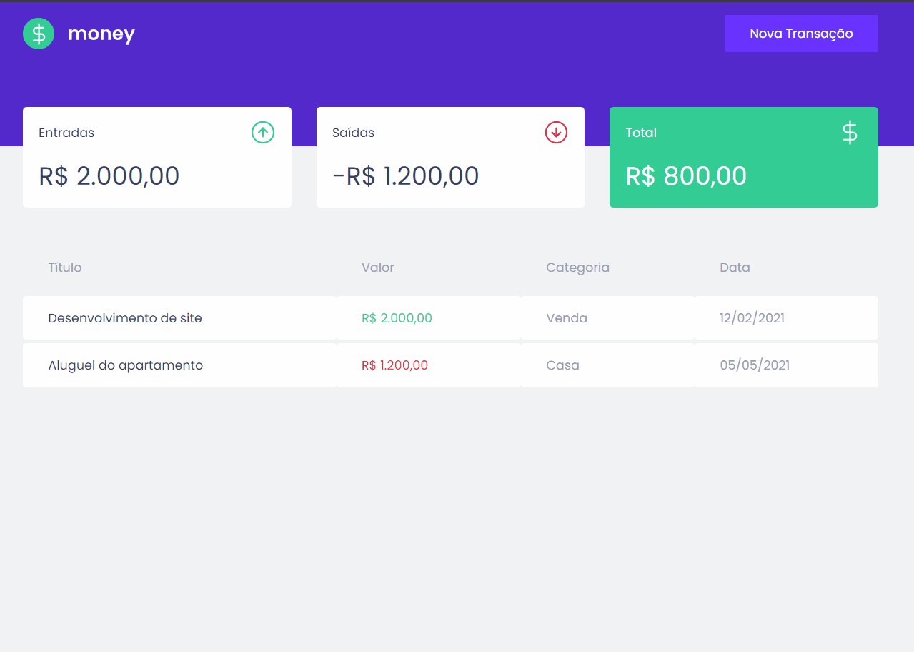

<!-- Logotipo -->
<div align="center">
  
</div>

<!-- Title -->
<p align="center"> RocketSeat 🔥 Ignite ReactJS </p>

<!-- Subtitle -->
<h2 align="center"> Módulo 2 - Primeira aplicação web com React ( DT Money ) </h2>

<!-- Badges -->
<p align="center">
  <a href="https://rocketseat.com.br">
    
  </a>
  
  
  
</p>

<!-- Sobre o Projeto -->

## 🚀 Sobre o Projeto

DT Money é um controle de contas financeiro pessoal que cadastra contas de entrada e saída, totaliza em cards utilizando uma biblioteca de Fake API MirajeJS que utiliza o formato JSON para fazer os cadastros.

## 🎥 Projeto

<div align="center">
  
</div>

## 🧰 Tecnologias e Bibliotecas

- [ReactJS](https://pt-br.reactjs.org/tutorial/tutorial.html)
  - [Styled Component](https://www.npmjs.com/package/styled-components) - Biblioteca CSS in JS
  - [Axios](https://www.npmjs.com/package/axios)
  - [React Modal](https://www.npmjs.com/package/react-modal)
  - [Polished](https://www.npmjs.com/package/polished)
- [TypeScript](https://www.typescriptlang.org/)

### Tools para criar API Fake

- [MirageJS](https://miragejs.com/)

## ⚙️ Rodando o Projeto

```bash
# Clone este repositório para a pasta anterior
$ git clone https://github.com/diogomfc/money.git
# ou use a opção de download.

# Acesse a pasta dtmoney
$ cd money

# Instale as dependências
$ yarn install
ou
$ npm install

# Executando o Projeto
$ yarn start
ou
$ npm start

# Acesse http://localhost:3000 no seu navagador
```

<div align="center">
  <small>Diogo Silva - 2021</small>
</div>
